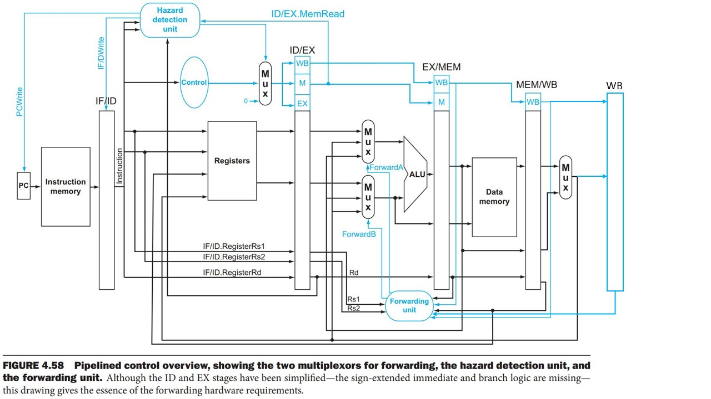

# RISC-V Processor

A simple RISC-V processor for learning.

## Overview

The main structure of `risc-v-processor` follows the Chapter 4 in [Computer Organization and Design](https://www.amazon.com/Computer-Organization-Design-RISC-V-Architecture/dp/0128122757) by David A. Patterson and John L. Hennessy as the figure below shows. Notice we add an extra set of pipeline registers WB in the writeback stage to avoid using special (positive and negtive edge triggering) register file (more on the last section of this document).



`risc-v-processor` currently supports 8 instructions as the table below shows. The instruction memory can contain at most 32 instructions. The register file consists of 32 1-byte-long general-purpose registers named from x0 to x31. The data memory has 32 1-byte-long cells whose contents are loaded from `data.mem` at initialization time. Also notice that the base registers in `ld` and `sd` instructions are hard-wired to 0, so you should only use the offset to index into the data memory.

| Instruction | Example | Meaning |
| --- | --- | --- |
| `nop` | nop | No action |
| `ld` | ld x5, 40(x6) | x5 = Memory[x6 + 40] |
| `sd` | sd x5, 40(x6) | Memory[x6 + 40] = x5 |
| `and` | and x5, x6, x7 | x5 = x6 & x7 |
| `or` | or x5, x6, x7 | x5 = x6 \| x7 |
| `add` | add x5, x6, x7 | x5 = x6 + x7 |
| `sub` | sub x5, x6, x7 | x5 = x6 - x7 |
| `beq` | beq x5, x6, 100 | if (x5 == x6) go to PC+100 |

## Installation and Setup

`risc-v-processor` is developed with [Icarus Verilog](http://iverilog.icarus.com/) (version 11.0). The assembler included in the repository is pre-compiled for Windows. If you are using other platforms, please go to its own [repository](https://github.com/pastchick3/risc-v-assembler) and compile the source code with a standard Rust toolchain.

`risc-v-processor` is implemented in both single-cycle and pipelined version. The default version is the pipelined version. To change to the single-cycle version, please open `src\driver.v` and comment out the `` `define pipelined`` directive on the first line.

## Quick Start

First, let's check out `data.mem`, whose contents are shown below. Because `risc-v-processor` does not support any instructions that involve immediate operands, we manually initialize the first and the second memory cell to be 3 and 1 respectively. After `data.mem` is loaded into the data memory of the processor, we can use `ld` instructions to load them into registers and do other computations.

``` MEM
00000011 00000001 00000000 00000000
00000000 00000000 00000000 00000000
00000000 00000000 00000000 00000000
00000000 00000000 00000000 00000000
00000000 00000000 00000000 00000000
00000000 00000000 00000000 00000000
00000000 00000000 00000000 00000000
00000000 00000000 00000000 00000000
```

The example program we will run is shown below and stored in `program.asm`. As the program says, we first load 3 and 1 into register x6 and x7 respectively. Then we perform `and`, `or`, `add`, and `sub` on these two registers and save results back to memory cell 2 to cell 5. Finally, we write x6 back to memory cell 6 and x7 back to memory cell 8 (Notice cell 7 is skipped because of the branch instruction).

``` ASM
ld x6, 0(x0)
ld x7, 1(x0)

and x5, x6, x7
sd x5, 2(x0)

or x5, x6, x7
sd x5, 3(x0)

add x5, x6, x7
sd x5, 4(x0)

sub x5, x6, x7
sd x5, 5(x0)

beq x6, x7, 4
sd x6, 6(x0)

beq x6, x6, 4
sd x7, 7(x0) //skipped
sd x7, 8(x0)
```

The next step is to compile the assembly file into an object file that can be loaded into the instruction memory of the processor. Here we will use `risc-v-assembler` shipped with the processor. The command below will compile `program.asm` into a 32-instruction-long `program.obj` with empty slots padded by `nop` (otherwise Icarus Verilog will complain about unintialized memory).

``` PowerShell
> .\risc-v-assembler.exe program.asm --padding 32
```

Now we can type the following commands to run the simulation. The processor will print the contents of the first nine memory cell in each clock cycle. You can also check the internal signal waveforms if you have installed Icarus Verilog's GTKWave component. The complete output and the trace of the execution of the first four instructions are shown in the next code block.

``` PowerShell
> iverilog -o Processor.vvp src/*.v
> vvp Processor.vvp
DataMem in Cycle  1: 00000011 00000001 00000000 00000000 00000000 00000000 00000000 00000000 00000000
...... <Output truncated>
> gtkwave Processor.vcd # If GTKWave is installed.
```

``` PowerShell
# Cycle 1: `ld x6, 0(x0)` starts.
DataMem in Cycle  1: 00000011 00000001 00000000 00000000 00000000 00000000 00000000 00000000 00000000
# Cycle 2: `ld x7, 1(x0)` starts.
DataMem in Cycle  2: 00000011 00000001 00000000 00000000 00000000 00000000 00000000 00000000 00000000
# Cycle 3: `and x5, x6, x7` starts.
DataMem in Cycle  3: 00000011 00000001 00000000 00000000 00000000 00000000 00000000 00000000 00000000
# Cycle 4: `and x5, x6, x7` stalls because the data hazard with `ld x7, 1(x0)`.
DataMem in Cycle  4: 00000011 00000001 00000000 00000000 00000000 00000000 00000000 00000000 00000000
# Cycle 5: `sd x5, 2(x0)` starts.
DataMem in Cycle  5: 00000011 00000001 00000000 00000000 00000000 00000000 00000000 00000000 00000000
# Cycle 6: `and x5, x6, x7` reaches the EX stage. x6 is forwarded from the new WB pipeline
# registers and x7 is forwarded from MEM/WB pipeline registers.
DataMem in Cycle  6: 00000011 00000001 00000000 00000000 00000000 00000000 00000000 00000000 00000000
# Cycle 7: `sd x5, 2(x0)` reaches the EX stage. x5 is forwared from EX/MEM pipeline registers.
DataMem in Cycle  7: 00000011 00000001 00000000 00000000 00000000 00000000 00000000 00000000 00000000
# Cycle 8: `sd x5, 2(x0)` reaches MEM stage.
DataMem in Cycle  8: 00000011 00000001 00000000 00000000 00000000 00000000 00000000 00000000 00000000
# Cycle 9: The memory change made by `sd x5, 2(x0)` is visible.
DataMem in Cycle  9: 00000011 00000001 00000001 00000000 00000000 00000000 00000000 00000000 00000000
DataMem in Cycle 10: 00000011 00000001 00000001 00000000 00000000 00000000 00000000 00000000 00000000
DataMem in Cycle 11: 00000011 00000001 00000001 00000011 00000000 00000000 00000000 00000000 00000000
DataMem in Cycle 12: 00000011 00000001 00000001 00000011 00000000 00000000 00000000 00000000 00000000
DataMem in Cycle 13: 00000011 00000001 00000001 00000011 00000100 00000000 00000000 00000000 00000000
DataMem in Cycle 14: 00000011 00000001 00000001 00000011 00000100 00000000 00000000 00000000 00000000
DataMem in Cycle 15: 00000011 00000001 00000001 00000011 00000100 00000010 00000000 00000000 00000000
DataMem in Cycle 16: 00000011 00000001 00000001 00000011 00000100 00000010 00000000 00000000 00000000
DataMem in Cycle 17: 00000011 00000001 00000001 00000011 00000100 00000010 00000011 00000000 00000000
DataMem in Cycle 18: 00000011 00000001 00000001 00000011 00000100 00000010 00000011 00000000 00000000
DataMem in Cycle 19: 00000011 00000001 00000001 00000011 00000100 00000010 00000011 00000000 00000000
DataMem in Cycle 20: 00000011 00000001 00000001 00000011 00000100 00000010 00000011 00000000 00000000
DataMem in Cycle 21: 00000011 00000001 00000001 00000011 00000100 00000010 00000011 00000000 00000001
```

## Modified Forwarding Schema

The original forwarding schema from the book uses two stages of pipeline registers (EX/MEM and MEM/WB), so it can forward data that just come out of the ALU and the data memory to the input ports of the ALU. Also, it requires a read operation of the register file can get the fresh value just written back in the same clock cycle to perform correct forwarding, which demands a special (positive and negtive triggering) hardware. To clearly demonstrate the problem, consider the execution of the first three instructions in our example program as the code block and the table below shows. At the clock cycle 6, the content of the x7 register is forwarded to the instruction 3 from the MEM/WB pipeline register, but the the instruction 3 cannot obtain the content of the x6 register from any pipeline registers because it has been written back to the register file and lost in the pipeline. Therefore, the instruction must secure the value at cycle 5, where the value is just written back to the register file. To avoiding such special hardware, an extra sets of pipeline registers WB with appropriate forwarding control logic are added in the writeback stage, so the content of x6 will be properly forwarded to instruction 3 at the clock cycle 6.

``` ASM
ld x6, 0(x0) // inst 1
ld x7, 1(x0) // inst 2
and x5, x6, x7 // inst 3
```

| Cycle 1 | Cycle 2 | Cycle 3 | Cycle 4 | Cycle 5 | Cycle 6 |
| --- | --- | --- | --- | --- | --- |
| inst 1 IF | inst 1 ID | inst 1 EX | inst 1 MEM | inst 1 WB | ? |
| | inst 2 IF | inst 2 ID | inst 2 EX | inst 2 MEM | inst 2 WB |
| | | inst 3 IF | inst 3 Stall | inst 3 ID | inst 3 EX |
